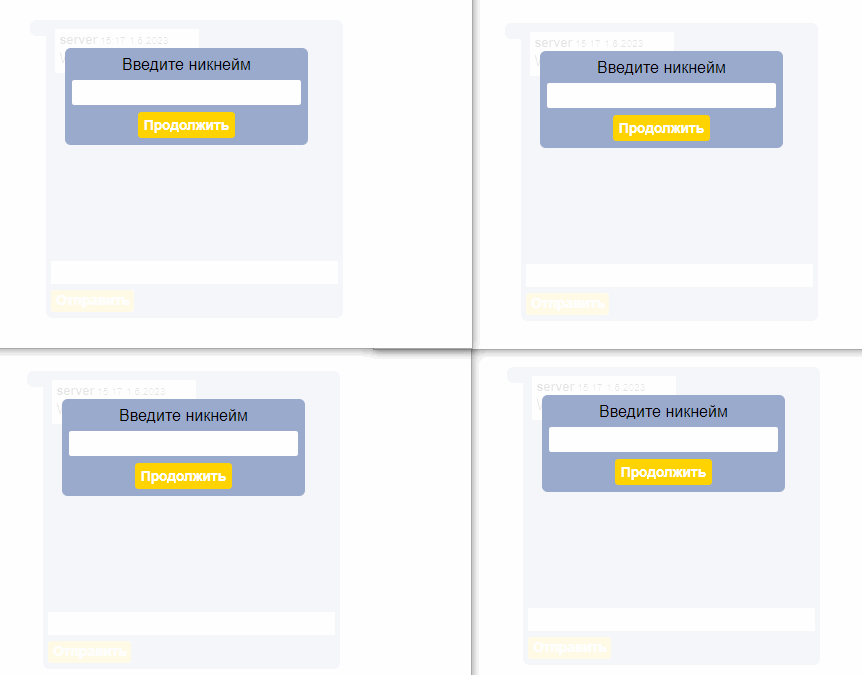

## Chat

 

Реализованы клиентская и [серверная](https://github.com/Go5710264/chat-back.git) части.
  
В серверной части применяются технологии **WebSocket** и **ServerSentEvents**.

 

1. При загрузке страницы появляется __всплывающее окно__, в которое необходимо ввести никнейм, под которым пользователь будет зарегистрирован в чате.
- Если такой _никнейм занят_ - в окне отображется всплывающее предупреждение.
2. Если никнейм свободен, то открывается __окно чата__.
3. Каждый новый пользователь отображается в __общем списке__ - с левой стороны от чата. 
5. Сообщения пользователя выравниваются по __правому__ краю, сообщения других участников отображаются по __левому__ краю.
6. Если пользователь закрывает чат (на гифке - перезагрузка страницы), то у других пользователей данный __никнейм удаляется__ из общего списка. 